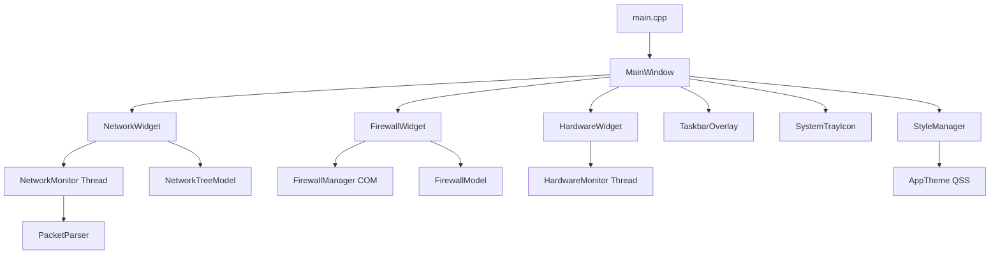

<div align="center">


# 🛡️ Ultimate NetGuard AIO

### The Most Powerful Network & System Monitor for Windows — All In One

[](https://github.com/alisakkaf/Ultimate-NetGuard-AIO/releases)
[](https://github.com/alisakkaf/Ultimate-NetGuard-AIO)
[](LICENSE)
[](https://www.qt.io/)
[](https://github.com/alisakkaf/Ultimate-NetGuard-AIO)
[](https://github.com/alisakkaf/Ultimate-NetGuard-AIO/stargazers)
[](https://github.com/alisakkaf/Ultimate-NetGuard-AIO/releases)

**A professional-grade, all-in-one network security suite that combines real-time packet-level traffic monitoring, Windows Firewall management, hardware system monitoring, and a sleek taskbar overlay — all built natively in C++ with zero external dependencies.**

<br>

[📥 Download Latest Release](https://github.com/alisakkaf/Ultimate-NetGuard-AIO/releases) · [📖 Full Features List](../FEATURES_EN.md) · [🌐 Website](https://alisakkaf.com) · [💬 Facebook](https://www.facebook.com/AliSakkaf.Dev/) · [🐛 Report Bug](https://github.com/alisakkaf/Ultimate-NetGuard-AIO/issues)

---


</div>

---

## 📋 Table of Contents

- [About](#-about)
- [Key Features](#-key-features)
- [Screenshots](#-screenshots)
- [System Requirements](#-system-requirements)
- [Installation](#-installation)
- [Building from Source](#-building-from-source)
- [Project Architecture](#-project-architecture)
- [Module Deep Dive](#-module-deep-dive)
  - [Network Traffic Monitor](#-module-1-real-time-network-traffic-monitor)
  - [Firewall Manager](#-module-2-windows-firewall-manager)
  - [Hardware Monitor](#-module-3-hardware-system-monitor)
  - [Usage History](#-module-4-network-usage-history)
  - [Settings](#-module-5-settings--configuration)
  - [Taskbar Overlay](#-module-6-taskbar-overlay-widget)
  - [System Tray](#-module-7-system-tray-icon)
  - [Theme System](#-module-8-theme-system)
- [Supported Protocols](#-supported-protocols)
- [Windows APIs Used](#-windows-apis-used)
- [Security & Privacy](#-security--privacy)
- [Disclaimer](#-disclaimer)
- [FAQ](#-faq)
- [Contributing](#-contributing)
- [License](#-license)
- [Support the Developer](#-support-the-developer)
- [Author](#-author)

---

## 🔍 About

**Ultimate NetGuard AIO** is a comprehensive network security and system monitoring application built from the ground up for Windows. Unlike other tools that rely on third-party packet capture libraries (like WinPcap or Npcap), Ultimate NetGuard AIO uses **native Windows raw sockets** (`SIO_RCVALL`) for packet capture, making it completely self-contained with **zero external dependencies**.

The application is designed for:
- **Network Administrators** who need real-time visibility into network traffic
- **Security Professionals** who want to monitor and control application network access
- **Power Users** who want to understand what their applications are doing on the network
- **IT Support Teams** who need a portable, no-install monitoring solution
- **Privacy-Conscious Users** who want to see and control every byte leaving their machine

### Why Ultimate NetGuard AIO?

| Feature | Ultimate NetGuard AIO | GlassWire | NetLimiter | Wireshark |
|---------|:--------------------:|:---------:|:----------:|:---------:|
| Per-process traffic monitoring | ✅ | ✅ | ✅ | ❌ |
| Built-in firewall manager | ✅ | ✅ | ✅ | ❌ |
| Hardware monitoring | ✅ | ❌ | ❌ | ❌ |
| Taskbar overlay | ✅ | ❌ | ❌ | ❌ |
| Zero dependencies | ✅ | ❌ | ❌ | ❌ |
| No driver installation | ✅ | ❌ | ❌ | ❌ |
| Portable executable | ✅ | ❌ | ❌ | ❌ |
| Open source | ✅ | ❌ | ❌ | ✅ |
| Free forever | ✅ | ❌ | ❌ | ✅ |
| Whitelist lockdown mode | ✅ | ❌ | ❌ | ❌ |

---

## 🚀 Key Features

<div align="center">

| Module | Description | Highlights |
|--------|-------------|------------|
| 🌐 **Network Monitor** | Real-time packet capture & analysis | Raw sockets, IPv4/IPv6, per-process tracking |
| 🛡️ **Firewall Manager** | Windows Firewall COM API integration | Block/Allow, Whitelist Lockdown, Drag & Drop |
| 💻 **Hardware Monitor** | CPU, RAM, GPU, Disk monitoring | WMI + PDH, temperature sensors, circular gauges |
| 📊 **Usage History** | Per-app daily bandwidth tracking | JSON persistence, CSV export, time filters |
| 🖥️ **Taskbar Overlay** | Live speed widget on Windows taskbar | Transparent, customizable, hover popup |
| 🎨 **Theme System** | Dark & Light modes | Live toggle, full QSS coverage |
| 🔔 **System Tray** | Activity indicator & quick controls | Dynamic icon, speed tooltip |
| ⚙️ **Settings** | Comprehensive configuration | Startup, overlay customization, persistence |

</div>

---

## 📸 Screenshots

<div align="center">

> **Note:** Add your screenshots to the `screenshots/` folder and update these paths.

| Dark Theme | Light Theme |
|:----------:|:-----------:|
|  |  |
|  |  |
|  |  |
|  |  |

</div>

---

## 📋 System Requirements

| Requirement | Minimum | Recommended |
|------------|---------|-------------|
| **Operating System** | Windows 7 SP1 | Windows 10/11 |
| **Architecture** | x86 (32-bit) | x86 or x64 |
| **RAM** | 64 MB | 128 MB |
| **Disk Space** | 15 MB | 25 MB |
| **Permissions** | **Administrator** (required) | Administrator |
| **Runtime Dependencies** | None (static Qt build) | None |
| **Network** | At least one active network adapter | Ethernet or Wi-Fi |

> **Important:** Administrator privileges are required for raw socket packet capture and Windows Firewall management. The application will automatically request elevation via UAC if not already running as administrator.

---

## 📦 Installation

### Option 1: Download Pre-Built Release (Recommended)

1. Go to the [Releases](https://github.com/alisakkaf/Ultimate-NetGuard-AIO/releases) page
2. Download `UltimateNetGuard-v1.0.0-win32.zip`
3. Extract to any folder
4. Run `UltimateNetGuard.exe` as Administrator
5. That's it — no installation required!

### Option 2: Build from Source

See [Building from Source](#-building-from-source) below.

---

## 🔧 Building from Source

### Prerequisites

| Tool | Version | Download |
|------|---------|----------|
| Qt | 5.14.2 | [qt.io/download](https://www.qt.io/download-qt-installer) |
| MinGW | 7.3.0 (32-bit) | Included with Qt installer |
| Git | Latest | [git-scm.com](https://git-scm.com/) |

### Build Steps

```bash
# 1. Clone the repository
git clone https://github.com/alisakkaf/Ultimate-NetGuard-AIO.git
cd Ultimate-NetGuard-AIO

# 2. Open Qt Creator and load UltimateNetGuard.pro
#    OR build from command line:

# 3. Set up the environment (adjust path to your Qt installation)
set PATH=C:\Qt\5.14.2\mingw73_32\bin;C:\Qt\Tools\mingw730_32\bin;%PATH%

# 4. Generate Makefile
qmake UltimateNetGuard.pro CONFIG+=release

# 5. Build
mingw32-make -j%NUMBER_OF_PROCESSORS%

# 6. The output binary is: release/UltimateNetGuard.exe
```

### Static Build (Portable)
```bash
# For a fully portable executable with no Qt DLL dependencies:
qmake UltimateNetGuard.pro CONFIG+=release CONFIG+=static
mingw32-make -j%NUMBER_OF_PROCESSORS%
```

---

## 🏗️ Project Architecture

```
Ultimate_NetGuard_AIO/
│
├── 📁 src/
│   ├── 📁 core/                    # Application Core
│   │   ├── mainwindow.h/cpp        # Main window controller, history engine, settings
│   │   ├── apptheme.h/cpp          # Full QSS stylesheets for Dark & Light themes
│   │   ├── stylemanager.h/cpp      # Singleton theme manager with signal emission
│   │   └── version.h               # Centralized version & publisher constants
│   │
│   ├── 📁 network/                 # Network Monitoring Engine
│   │   ├── networkmonitor.h/cpp    # Raw socket capture thread (IPv4+IPv6)
│   │   ├── networkmodel.h/cpp      # Custom QAbstractItemModel tree model
│   │   ├── networkwidget.h/cpp     # Network tab UI, context menus, process dialogs
│   │   └── packetparser.h/cpp      # Wire-format packet structs & protocol resolver
│   │
│   ├── 📁 firewall/                # Firewall Management
│   │   ├── firewallmanager.h/cpp   # Windows COM API (INetFwPolicy2) integration
│   │   ├── firewallmodel.h/cpp     # QAbstractTableModel for firewall rules
│   │   └── firewallwidget.h/cpp    # Firewall tab UI, drag-drop, import/export
│   │
│   ├── 📁 hardware/                # Hardware Monitoring
│   │   ├── hardwaremonitor.h/cpp   # WMI + PDH monitoring thread
│   │   └── hardwarewidget.h/cpp    # Circular gauges, temp bars, network I/O
│   │
│   ├── 📁 taskbar/                 # Taskbar Integration
│   │   ├── taskbaroverlay.h/cpp    # Transparent taskbar speed widget + hover popup
│   │   └── systemtrayicon.h/cpp    # System tray icon with dynamic activity dot
│   │
│   ├── 📁 ui/                      # Qt Designer Forms
│   │   ├── mainwindow.ui           # Main window layout (575 lines)
│   │   ├── networkwidget.ui        # Network tab layout
│   │   ├── firewallwidget.ui       # Firewall tab layout
│   │   └── hardwarewidget.ui       # Hardware tab layout
│   │
│   ├── 📁 Info/                    # Documentation & Resources
│   │   ├── FEATURES_EN.md          # Complete English feature list
│   │   ├── FEATURES_AR.md          # Complete Arabic feature list
│   │   └── 📁 github/              # GitHub repository files
│   │
│   └── main.cpp                    # Entry point, admin elevation, single-instance
│
├── 📁 icons/                       # Application icons (ICO + PNG)
│   ├── app.ico                     # Windows icon
│   └── Ultimate_NetGuard_AIO.png   # High-res PNG icon
│
├── appicon.rc                      # Windows resource script (VERSIONINFO + icon)
├── app.manifest                    # UAC manifest (requireAdministrator)
├── resources.qrc                   # Qt resource compilation file
└── UltimateNetGuard.pro            # qmake project file
```

### Dependency Graph



---

## 🔬 Module Deep Dive

### 🌐 Module 1: Real-Time Network Traffic Monitor

The network monitor is the heart of Ultimate NetGuard AIO. It provides deep, per-process visibility into all network traffic on your machine.

#### How It Works

1. **Raw Socket Creation**: The monitor creates two raw sockets — one for IPv4 (`AF_INET`) and one for IPv6 (`AF_INET6`) — bound to the active network adapter.

2. **Promiscuous Mode**: Using `SIO_RCVALL`, both sockets are set to capture ALL traffic passing through the adapter (not just traffic destined for the local machine).

3. **Adapter Selection**: The `pickBestAdapter()` function queries the Windows routing table via `GetBestInterface()` to find the adapter handling internet traffic. It then cross-references this with `GetAdaptersAddresses()` to get the adapter's IP addresses, explicitly filtering out virtual adapters (VMware, VirtualBox, Radmin, ZeroTier, etc.).

4. **Packet Parsing**: The `PacketParser` class defines C-style wire-format structs for:
   - IPv4 header (20+ bytes)
   - IPv6 header (40 bytes)  
   - TCP header (20+ bytes)
   - UDP header (8 bytes)
   - ICMP header (8 bytes)

5. **Process Resolution**: A background cache thread maintains two data structures:
   - **Extended TCP Table** (`GetExtendedTcpTable` with `TCP_TABLE_OWNER_PID_ALL`) — maps TCP connections to PIDs
   - **Extended UDP Table** (`GetExtendedUdpTable` with `UDP_TABLE_OWNER_PID`) — maps UDP listeners to PIDs
   - Both IPv4 and IPv6 variants are queried

6. **Service Resolution**: For `svchost.exe` processes, the monitor calls `EnumServicesStatusEx()` to identify the specific Windows service running under that PID.

7. **Tree Model**: The custom `NetworkTreeModel` (inheriting `QAbstractItemModel`) organizes data as:
   ```
   Process Name (aggregated stats)
   ├── Connection 1 (source:port → dest:port, protocol, speed)
   ├── Connection 2
   └── Connection 3
   ```

8. **Performance**: Packets are batched (every 250ms or 3000 packets, whichever comes first) to minimize GUI thread overhead. Speed is calculated per-second using delta byte tracking.

#### Data Columns

| # | Column | Description | Sort Type |
|---|--------|-------------|-----------|
| 0 | Application / Protocol | Process name or protocol name | Alphabetical |
| 1 | Source | Source IP:Port | Alphabetical |
| 2 | Destination | Destination IP:Port | Alphabetical |
| 3 | Service | Resolved service name (HTTP, DNS, etc.) | Alphabetical |
| 4 | Download Speed | Current RX speed (auto-scaled) | Numeric (UserRole+5) |
| 5 | Upload Speed | Current TX speed (auto-scaled) | Numeric (UserRole+5) |
| 6 | Total Bytes | Cumulative bytes transferred | Numeric (UserRole+5) |
| 7 | Packets | Total packet count | Numeric (UserRole+5) |

#### Context Menu Actions

| Action | Description | Implementation |
|--------|-------------|----------------|
| Kill Process | Terminate the selected process | `OpenProcess()` + `TerminateProcess()` |
| Process Properties | Show detailed info dialog | Custom `QDialog` with icon, path, stats |
| Open File Location | Open Explorer at process path | `QDesktopServices::openUrl()` with `/select,` |
| Copy Connection Info | Copy src:port to clipboard | `QApplication::clipboard()->setText()` |

---

### 🛡️ Module 2: Windows Firewall Manager

The firewall module provides direct COM API access to Windows Firewall (Windows Defender Firewall with Advanced Security).

#### COM Architecture

```
FirewallManager
    ├── CoInitializeEx(COINIT_APARTMENTTHREADED)
    ├── CoCreateInstance(NetFwPolicy2)
    │   └── INetFwPolicy2 *m_fwPolicy
    │       └── get_Rules()
    │           └── INetFwRules *m_fwRules
    │               ├── Add(INetFwRule*)
    │               ├── Remove(BSTR name)
    │               ├── Item(BSTR name, INetFwRule**)
    │               └── get__NewEnum() → IEnumVARIANT
    └── Netsh Fallback (QProcess → netsh advfirewall)
```

#### Rule Creation Flow

```
User selects app.exe → expandAndCleanPath() → resolveShortcut() (if .lnk)
    → makeRuleName("NetGuard_AppName_BLOCK_OUT")
    → CoCreateInstance(CLSID_NetFwRule)
    → put_Name(), put_ApplicationName(), put_Action(), put_Direction()
    → m_fwRules->Add(rule)
    → emit rulesChanged()
```

#### Whitelist Lockdown Mode

When enabled, the lockdown mode:
1. Forces Windows Firewall ON across all profiles
2. Sets default outbound action to BLOCK for Domain, Private, and Public profiles
3. Iterates all existing rules and disables any outbound ALLOW rule not prefixed with `NetGuard_`
4. Creates ALLOW rules for `svchost.exe` and `System` to prevent OS breakage
5. Uses `netsh advfirewall set allprofiles firewallpolicy blockinbound,blockoutbound` as reinforcement

---

### 💻 Module 3: Hardware System Monitor

#### Data Collection Pipeline

```
HardwareMonitor Thread (1-second loop)
    ├── collectPdh()        → CPU Load %, Disk Activity %
    ├── collectRam()        → Used/Total MB, Load %
    ├── collectNetwork()    → RX/TX bytes per second
    ├── queryGpuLoad()      → GPU 3D engine utilization %
    └── collectTemperatures()
        ├── Disk Temp    ← MSFT_StorageReliabilityCounter (ROOT\Microsoft\Windows\Storage)
        ├── CPU Temp     ← MSAcpi_ThermalZoneTemperature (ROOT\WMI) [Kelvin→Celsius]
        │   Fallback A:  ← Win32_TemperatureProbe (ROOT\CIMV2)
        │   Fallback B:  ← Win32_PerfFormattedData_Counters_ThermalZoneInformation
        ├── GPU Temp     ← WMI GPU sensor queries
        └── MB Temp      ← Lowest ACPI thermal zone reading
```

#### WMI Namespaces

| Namespace | Purpose | Classes Used |
|-----------|---------|--------------|
| `ROOT\CIMV2` | Standard hardware info | `Win32_PerfFormattedData_GPUPerformanceCounters_GPUEngine`, `Win32_TemperatureProbe`, `Win32_PerfFormattedData_Counters_ThermalZoneInformation` |
| `ROOT\WMI` | ACPI thermal zones | `MSAcpi_ThermalZoneTemperature` |
| `ROOT\Microsoft\Windows\Storage` | Disk health | `MSFT_StorageReliabilityCounter` |

#### Circular Gauge Rendering

The `CircularGauge` widget uses custom `QPaintEvent` rendering:
- **Arc Angle**: 270° sweep (from 7 o'clock to 5 o'clock)
- **Color Logic**: Blue (#3B82F6) < 60%, Amber (#F59E0B) < 85%, Red (#EF4444) ≥ 85%
- **Typography**: Segoe UI 18pt bold for percentage, 8pt for temperature
- **Theme Awareness**: Uses `QPalette::WindowText` for automatic Dark/Light adaptation

---

### 📊 Module 4: Network Usage History

#### Data Flow

```
NetworkTreeModel (live data)
    → MainWindow::onHistoryTick() [every 1 second]
    → Extract per-app RX/TX bytes
    → Accumulate in m_historyData[date][appName]
    → Auto-save to JSON every 60 seconds
    → UI refresh when History tab is active
```

#### JSON Schema

```json
{
    "2026-04-18": {
        "chrome.exe": { "rx": 15728640, "tx": 2097152 },
        "discord.exe": { "rx": 5242880, "tx": 1048576 }
    },
    "2026-04-17": {
        "firefox.exe": { "rx": 31457280, "tx": 4194304 }
    }
}
```

---

### ⚙️ Module 5: Settings & Configuration

| Setting | Storage | Key |
|---------|---------|-----|
| Dark/Light Theme | QSettings (Registry) | `theme` |
| Run at Startup | Registry `HKCU\...\Run` | `UltimateNetGuard` |
| Start Minimized | QSettings | `startMinimized` |
| Overlay Enabled | QSettings | `overlayEnabled` |
| Overlay Font Size | QSettings | `overlayFontSize` |
| Overlay Opacity | QSettings | `overlayOpacity` |
| Overlay Text Color | QSettings | `overlayTextColor` |
| Overlay BG Color | QSettings | `overlayBgColor` |

---

### 🖥️ Module 6: Taskbar Overlay Widget

#### Window Management

The overlay uses several Windows API tricks to stay visible on the taskbar:

1. **Window Flags**: `Qt::Tool | Qt::FramelessWindowHint | Qt::WindowStaysOnTopHint | Qt::WindowDoesNotAcceptFocus`
2. **Extended Style**: `WS_EX_TOOLWINDOW | WS_EX_NOACTIVATE` (prevents taskbar entry and focus stealing)
3. **Parenting**: `SetWindowLongPtr(GWLP_HWNDPARENT, Shell_TrayWnd)` — makes the overlay a child of the taskbar
4. **Z-Order**: `SetWindowPos(HWND_TOPMOST)` every 500ms to maintain visibility
5. **Position**: Calculated relative to `TrayNotifyWnd` (the system tray area), positioned to the left of the notification area
6. **Explorer Restart**: Detects parent window loss and re-parents automatically

#### Stats Popup

The hover popup shows 6 live metrics in a 3×2 grid:

| Row | Left Column | Right Column |
|-----|-------------|--------------|
| 1 | ↓ Download Speed | ↑ Upload Speed |
| 2 | 📥 Session Total DL | 📤 Session Total UL |
| 3 | 💻 CPU Load % | 🧠 RAM Load % |

---

### 🔔 Module 7: System Tray Icon

The system tray icon provides:
- **Dynamic Icon**: Loads from `:/icons/Ultimate_NetGuard_AIO.png` with fallback to `:/icons/app.ico`
- **Activity Dot**: A 5×5 pixel circle drawn at (10,10) on the 16×16 icon
  - Green (#34D399) when traffic detected (rxBps > 0 || txBps > 0)
  - Gray (#71717A) when idle
- **Tooltip**: Updates with current download/upload speeds
- **Context Menu**: Show NetGuard / Quit NetGuard

---

### 🎨 Module 8: Theme System

#### Dark Theme Palette

| Element | Color | Hex |
|---------|-------|-----|
| Background | Zinc 900 | `#18181B` |
| Surface | Zinc 800 | `#27272A` |
| Border | Zinc 700 | `#3F3F46` |
| Text Primary | Zinc 200 | `#E4E4E7` |
| Text Secondary | Zinc 400 | `#A1A1AA` |
| Primary | Blue 500 | `#3B82F6` |
| Primary Hover | Blue 400 | `#60A5FA` |
| Success | Emerald 500 | `#10B981` |
| Warning | Amber 500 | `#F59E0B` |
| Danger | Red 500 | `#EF4444` |

#### Light Theme Palette

| Element | Color | Hex |
|---------|-------|-----|
| Background | Zinc 100 | `#F4F4F5` |
| Surface | White | `#FFFFFF` |
| Border | Zinc 300 | `#D4D4D8` |
| Text Primary | Zinc 800 | `#27272A` |
| Primary | Blue 600 | `#2563EB` |
| Selection | Blue 100 | `#DBEAFE` |

---

## 📡 Supported Protocols

<div align="center">

| Protocol | Port | Category | Description |
|----------|------|----------|-------------|
| HTTP | 80 | Web | Hypertext Transfer Protocol |
| HTTPS | 443 | Web | HTTP over TLS/SSL |
| HTTP/2 | 8080 | Web | Alternative HTTP port |
| DNS | 53 | Network | Domain Name System |
| DoH | 853 | Network | DNS over HTTPS |
| DHCP | 67, 68 | Network | Dynamic Host Configuration Protocol |
| NTP | 123 | Network | Network Time Protocol |
| SSH | 22 | Remote | Secure Shell |
| FTP | 20, 21 | File Transfer | File Transfer Protocol |
| FTPS | 990 | File Transfer | FTP over TLS |
| SFTP | 115 | File Transfer | SSH File Transfer Protocol |
| SMTP | 25, 587 | Email | Simple Mail Transfer Protocol |
| SMTPS | 465 | Email | SMTP over TLS |
| IMAP | 143 | Email | Internet Message Access Protocol |
| IMAPS | 993 | Email | IMAP over TLS |
| POP3 | 110 | Email | Post Office Protocol v3 |
| POP3S | 995 | Email | POP3 over TLS |
| MySQL | 3306 | Database | MySQL Database |
| PostgreSQL | 5432 | Database | PostgreSQL Database |
| MongoDB | 27017 | Database | MongoDB NoSQL Database |
| Redis | 6379 | Database | Redis Key-Value Store |
| MSSQL | 1433 | Database | Microsoft SQL Server |
| RDP | 3389 | Remote | Remote Desktop Protocol |
| VNC | 5900 | Remote | Virtual Network Computing |
| Telnet | 23 | Remote | Telnet Protocol |
| LDAP | 389 | Directory | Lightweight Directory Access Protocol |
| LDAPS | 636 | Directory | LDAP over TLS |
| NetBIOS | 137-139 | Windows | NetBIOS Name/Datagram/Session |
| SMB | 445 | Windows | Server Message Block |
| Kerberos | 88 | Auth | Kerberos Authentication |
| SNMP | 161, 162 | Monitoring | Simple Network Management Protocol |
| Syslog | 514 | Monitoring | System Logging Protocol |
| IKE | 500 | VPN | Internet Key Exchange |
| OpenVPN | 1194 | VPN | OpenVPN Protocol |
| WireGuard | 51820 | VPN | WireGuard VPN |
| SIP | 5060, 5061 | VoIP | Session Initiation Protocol |
| STUN | 3478 | VoIP | Session Traversal Utilities for NAT |
| ICMP | — | Network | Internet Control Message Protocol |
| ICMPv6 | — | Network | ICMP for IPv6 |
| TCP | — | Transport | Transmission Control Protocol |
| UDP | — | Transport | User Datagram Protocol |
| IGMP | — | Multicast | Internet Group Management Protocol |
| GRE | — | Tunneling | Generic Routing Encapsulation |

</div>

---

## 🔧 Windows APIs Used

<div align="center">

| API | Header | Purpose |
|-----|--------|---------|
| `WSASocket` / `WSAIoctl` | `winsock2.h` | Raw socket creation and `SIO_RCVALL` |
| `GetExtendedTcpTable` | `iphlpapi.h` | Map TCP connections → PIDs |
| `GetExtendedUdpTable` | `iphlpapi.h` | Map UDP listeners → PIDs |
| `GetBestInterface` | `iphlpapi.h` | Find active internet adapter |
| `GetAdaptersAddresses` | `iphlpapi.h` | Enumerate network adapters |
| `GetIfTable` / `GetIfEntry2` | `iphlpapi.h` | Network interface statistics |
| `EnumServicesStatusEx` | `winsvc.h` | Identify svchost.exe services |
| `OpenProcess` / `TerminateProcess` | `windows.h` | Process management |
| `SHGetFileInfoW` | `shellapi.h` | Extract application icons |
| `ShellExecuteExW` | `shellapi.h` | UAC elevation |
| `CreateMutexW` | `windows.h` | Single-instance enforcement |
| `CoCreateInstance` | `objbase.h` | COM object instantiation |
| `INetFwPolicy2` / `INetFwRules` | `netfw.h` | Windows Firewall COM API |
| `IShellLinkW` | `shobjidl.h` | Shortcut (.lnk) resolution |
| `ExpandEnvironmentStringsW` | `windows.h` | Environment variable expansion |
| `IWbemLocator` / `IWbemServices` | `wbemidl.h` | WMI queries |
| `PdhOpenQuery` / `PdhAddCounter` | `pdh.h` | Performance Data Helper counters |
| `GlobalMemoryStatusEx` | `windows.h` | RAM usage statistics |
| `FindWindowW` / `SetWindowPos` | `windows.h` | Taskbar overlay positioning |
| `SetWindowLongPtr` | `windows.h` | Window style modification |
| `AdjustTokenPrivileges` | `advapi32.h` | Enable SeDebugPrivilege |
| `IsUserAnAdmin` | `shlobj.h` | Admin privilege check |

</div>

---

## 🔒 Security & Privacy

- **No Telemetry**: The application does NOT collect, transmit, or store any user data outside the local machine
- **No Internet Access**: The application itself makes ZERO outbound network connections
- **Local Storage Only**: All data (history, settings) is stored locally in `%AppData%` and Windows Registry
- **No Cloud**: No cloud services, no accounts, no registration
- **Open Source**: Full source code available for audit
- **No Drivers**: Unlike competing products, no kernel-mode drivers are installed
- **Admin Required**: Requires administrator privileges for raw socket access and firewall management — this is a Windows security requirement, not a design choice

---

## ⚠️ Disclaimer

> **IMPORTANT LEGAL NOTICE**

This software is provided **"AS IS"** without warranty of any kind. The author (Ali Sakkaf) is **NOT responsible** for any damage, data loss, network issues, or system problems that may arise from using this software.

**This tool is intended for:**
- ✅ Monitoring YOUR OWN network traffic on YOUR OWN computer
- ✅ Managing YOUR OWN Windows Firewall rules
- ✅ Educational and learning purposes
- ✅ Network administration on systems you own or have permission to monitor

**This tool is NOT intended for:**
- ❌ Intercepting other people's network traffic
- ❌ Bypassing network security policies
- ❌ Any illegal or unauthorized monitoring activities
- ❌ Any malicious purposes

**By using this software, you agree that:**
1. You will only use it on systems you own or have explicit authorization to monitor
2. You are solely responsible for compliance with all applicable local, state, national, and international laws
3. The author bears no liability for misuse of this tool

See [DISCLAIMER.md](DISCLAIMER.md) for the full legal disclaimer.

---

## ❓ FAQ

<details>
<summary><b>Q: Why does the app require Administrator privileges?</b></summary>

Windows requires Administrator privileges for:
1. **Raw socket packet capture** (`SIO_RCVALL`) — this is a Windows kernel-level restriction
2. **Windows Firewall management** — modifying firewall rules requires elevation
3. **Process information access** — reading information about system processes requires `SeDebugPrivilege`

This is not a design choice but a Windows security requirement.
</details>

<details>
<summary><b>Q: Is this a virus or malware?</b></summary>

**Absolutely not.** The source code is 100% open and available for review. Some antivirus software may flag it because:
1. It uses raw sockets (a technique also used by network scanning tools)
2. It modifies Windows Firewall rules
3. It injects itself as a startup program

These are all legitimate features for a network monitoring tool. You can build the application from source yourself to verify.
</details>

<details>
<summary><b>Q: Why is my antivirus flagging this?</b></summary>

False positives are common for network monitoring tools because they use APIs that are also used by malicious software (raw sockets, firewall modification, process enumeration). You can:
1. Review the source code
2. Build from source yourself
3. Add an exception in your antivirus
4. Submit the binary to your AV vendor for re-analysis
</details>

<details>
<summary><b>Q: Does this capture HTTPS content?</b></summary>

**No.** This tool captures network packets at the IP layer, which means it can see:
- Source and destination IP addresses
- Source and destination ports
- Protocol type
- Packet sizes

It **cannot** see the encrypted content of HTTPS traffic. It only sees that traffic is going to/from a specific IP on port 443.
</details>

<details>
<summary><b>Q: Can I use this on a network I don't own?</b></summary>

**Only with explicit authorization.** This tool is designed for monitoring your own machine's traffic. Using it to monitor traffic on networks or machines without authorization may violate local laws.
</details>

<details>
<summary><b>Q: Why no temperature readings for my CPU?</b></summary>

CPU temperature via WMI depends on BIOS/UEFI support. Many modern motherboards don't expose temperature data through the `MSAcpi_ThermalZoneTemperature` WMI class. The application has 3 fallback mechanisms, but if none work, it will show "N/A". For accurate temperature readings, consider using hardware-specific tools like HWiNFO or Core Temp alongside this tool.
</details>

---

## 🤝 Contributing

Contributions are welcome! Please read the [CONTRIBUTING.md](CONTRIBUTING.md) before submitting pull requests.

1. Fork the repository
2. Create a feature branch (`git checkout -b feature/amazing-feature`)
3. Commit your changes (`git commit -m 'Add amazing feature'`)
4. Push to the branch (`git push origin feature/amazing-feature`)
5. Open a Pull Request

---

## 📄 License

This project is licensed under the **MIT License** — see the [LICENSE](LICENSE) file for details.

```
MIT License

Copyright (c) 2026 Ali Sakkaf

Permission is hereby granted, free of charge, to any person obtaining a copy
of this software and associated documentation files (the "Software"), to deal
in the Software without restriction, including without limitation the rights
to use, copy, modify, merge, publish, distribute, sublicense, and/or sell
copies of the Software, and to permit persons to whom the Software is
furnished to do so, subject to the following conditions:

The above copyright notice and this permission notice shall be included in all
copies or substantial portions of the Software.
```

---

## 💡 Support the Developer

<div align="center">
  <i>If you find my tools and projects useful, consider supporting my work. Your support helps keep these projects completely free!</i>
</div>

<br>

<div align="center">

| Crypto Asset | Network | Wallet Address (Copy) | Quick Scan |
| :--- | :--- | :--- | :---: |
|  | **TRC20** | `TYLBeDA5aGNcc3WkVqf3xWPHXmsZzs2p28` | <a href="https://api.qrserver.com/v1/create-qr-code/?size=300x300&margin=10&data=TYLBeDA5aGNcc3WkVqf3xWPHXmsZzs2p28" target="_blank"></a> |
|  | **BEP20** | `0x67cf27f33c80479ea96372810f9e2ee4c3b095c5` | <a href="https://api.qrserver.com/v1/create-qr-code/?size=300x300&margin=10&data=0x67cf27f33c80479ea96372810f9e2ee4c3b095c5" target="_blank"></a> |
|  | **Bitcoin** | `bc1q97dr37h37npzarmmrv0tjz2nm50htqc7pfpzj6` | <a href="https://api.qrserver.com/v1/create-qr-code/?size=300x300&margin=10&data=bitcoin:bc1q97dr37h37npzarmmrv0tjz2nm50htqc7pfpzj6" target="_blank"></a> |
|  | **ERC20** | `0x67cf27f33c80479ea96372810F9e2EE4C3b095C5` | <a href="https://api.qrserver.com/v1/create-qr-code/?size=300x300&margin=10&data=ethereum:0x67cf27f33c80479ea96372810F9e2EE4C3b095C5" target="_blank"></a> |
|  | **Solana** | `Cbesgr4tvo4T1inNMFe46GSym2qMYjkmofbXFc77rDNK` | <a href="https://api.qrserver.com/v1/create-qr-code/?size=300x300&margin=10&data=solana:Cbesgr4tvo4T1inNMFe46GSym2qMYjkmofbXFc77rDNK" target="_blank"></a> |
|  | **ERC20** | `0x67cf27f33c80479ea96372810f9e2ee4c3b095c5` | <a href="https://api.qrserver.com/v1/create-qr-code/?size=300x300&margin=10&data=0x67cf27f33c80479ea96372810f9e2ee4c3b095c5" target="_blank"></a> |
|  | **SPL** | `Cbesgr4tvo4T1inNMFe46GSym2qMYjkmofbXFc77rDNK` | <a href="https://api.qrserver.com/v1/create-qr-code/?size=300x300&margin=10&data=solana:Cbesgr4tvo4T1inNMFe46GSym2qMYjkmofbXFc77rDNK" target="_blank"></a> |
|  | **BEP20** | `0x67cf27f33c80479ea96372810F9e2EE4C3b095C5` | <a href="https://api.qrserver.com/v1/create-qr-code/?size=300x300&margin=10&data=0x67cf27f33c80479ea96372810F9e2EE4C3b095C5" target="_blank"></a> |

</div>

---

## 👨‍💻 Author

<div align="center">

**Ali Sakkaf**

[](https://alisakkaf.com)
[](https://www.facebook.com/AliSakkaf.Dev/)
[](https://github.com/alisakkaf)

</div>

---

<div align="center">

**© 2026 Ali Sakkaf. All Rights Reserved.**

Made with ❤️ in Yemen

⭐ **If you like this project, please give it a star!** ⭐

</div>
